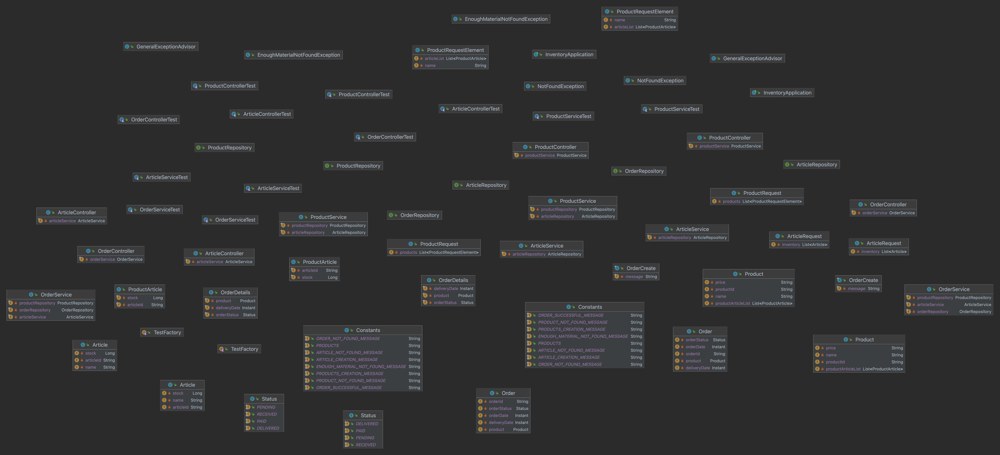
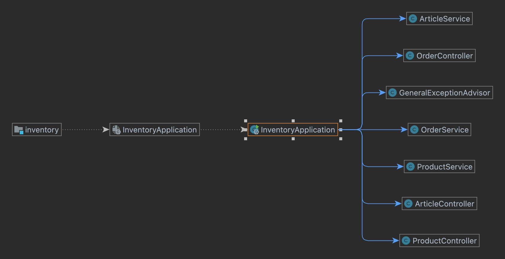

# Product Inventory Project

## Description
* The project is to implement warehouse software. This software holds articles. The articles contain an id, a name, and available stock. The warehouse software also has products, products are made of different articles. Products have a name,
  price, and a list of articles from which they are made from with a quantity. With the product id, we can create an order. If the order
  created successfully the software should change the articles stock amount and create an order record in the database

### Reference Documentation
For further reference, please consider the following sections:

* [Official Apache Maven documentation](https://maven.apache.org/guides/index.html)
* [Spring Boot Maven Plugin Reference Guide](https://docs.spring.io/spring-boot/docs/3.0.3/maven-plugin/reference/html/)
* [Create an OCI image](https://docs.spring.io/spring-boot/docs/3.0.3/maven-plugin/reference/html/#build-image)
* [Spring Data MongoDB](https://docs.spring.io/spring-boot/docs/3.0.3/reference/htmlsingle/#data.nosql.mongodb)
* [MongoDB](https://www.mongodb.com/docs/manual/reference/)
* [Docker](https://docs.docker.com/reference)
* [Kotlin](https://kotlinlang.org/docs/home.html)
* [Swagger](https://swagger.io/docs)
* [JUnit](https://junit.org/junit5/docs/current/user-guide/)
* [SonarQube](https://docs.sonarqube.org/latest)
* [MockK](https://mockk.io)
* [Mockito](https://javadoc.io/doc/org.mockito/mockito-core/latest/org/mockito/Mockito.html)
* [Test Containers](https://www.testcontainers.org)

### Values
* Mongo DB is running on 27017 port. You should use this syntax for connection:
* Inventory application is running on [8080](http://localhost:8080) port


### Containerizing and Deployment
* In this project we have 1 docker file and 1 docker compose file.
* Docker file includes maven download, maven build command and java jar file build
  * You also have an option for maven manual build.
* [Docker compose file](docker-compose.yml) includes 2 different images
* The first image is Mongo DB. Mongo DB image needs 2 different files.
  * [.env](.env) file includes mongo db version, container name and spring boot ports.
  * [inventory.js](inventory.js) file includes database user creation
* The second image is Inventory Application image created by the [DockerFile](Dockerfile)
  * Application image depends on Mongo DB instance. If the application gets an error, it will restart the application by itself
  * You can add another environment variable to environment tab. 
  You can use like an [application.properties](src/main/resources/application.properties) element
* If you want to run this project on a docker container, you just need to run this command:
  ```bash 
    docker compose up -d
  ```
### Class Diagram


### Spring Diagram



### Swagger
* After startup, you can access the Swagger documentation site with [this](http://localhost:8080/swagger-ui.html) URL

### Postman Collection Url
* After startup, you should import [this](src/main/resources/Inventory%20Collection.postman_collection.json) file to Postman Application.
  With these requests, you can successfully create products, articles and orders.

### Next Steps
* My next step would be adding more endpoints to control whole application. After endpoint enhanced, 
I would create nice UI/UX designed frontend side. It would be separated project and I would use React.js (```v1.1.0```)
* After creation process of frontend, I would create Authorization and Authentication part. we would be able to
  log in via Jwt bearer token as a result we would create data safety.(```v1.2.0```)
* Kubernetes, AWS integration and pipeline would be great for deployment. We can have automated deployment(```v2.0.0```)

